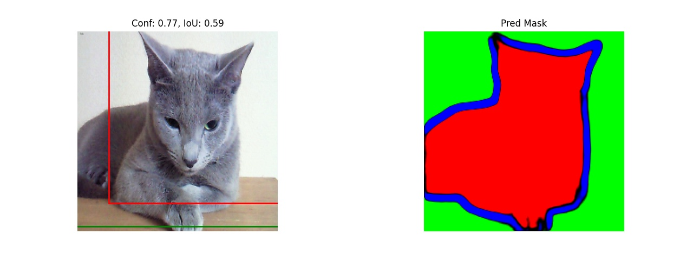
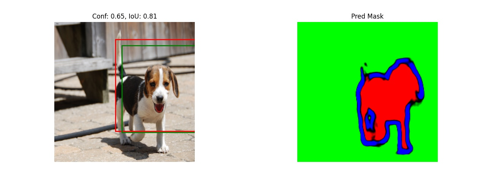
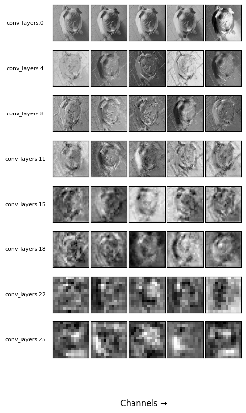

# Object Detection from Scratch

Github: 
https://github.com/Mafaz03/Object-Detection-from-scratch

W&b report:
https://api.wandb.ai/links/mafaz03/ce3lg7e2

This repository implements a multi-task pet perception pipeline using the Oxford-IIIT Pet dataset. It combines three tasks in one project:

- **Breed classification** with a VGG-style classifier
- **Bounding box localization** using a regression head
- **Instance segmentation** using a U-Net decoder built on top of a VGG encoder

## Repository structure

- `train.py` — training script for classifier, localizer, and UNet modules
- `inference.py` — sample inference run, metrics computation, and visualization
- `data/pets_dataset.py` — dataset loader for Oxford-IIIT Pet images, annotations, bounding boxes, and trimaps
- `models/` — model implementations
  - `classification.py` — VGG11-based breed classifier
  - `localization.py` — VGG11-based bounding box regressor
  - `segmentation.py` — VGG11-backed U-Net segmentation model
  - `multitask.py` — wrapper that initializes and manages all three subtasks
- `losses/` — loss definitions for segmentation and localization
- `checkpoints/` — model checkpoint output directory
- `oxford-iiit-pet/` — dataset folder containing images and annotations

## Dependencies

Install the required Python packages with:

```bash
pip install torch torchvision matplotlib numpy tqdm pandas pillow wandb
```

> If you use a CUDA-enabled GPU, install the matching PyTorch build from https://pytorch.org.

## Dataset

This project expects the Oxford-IIIT Pet dataset to be available at `oxford-iiit-pet/` in the repository root.

The dataset loader uses:

- `annotations/list.txt` for breed and class mappings
- `annotations/xmls/` for bounding box labels
- `annotations/trimaps/` for segmentation masks
- `images/` for input RGB images

## Training

The training script supports separate training for each task.

### Train classifier only

```bash
python train.py -t_c -d_path oxford-iiit-pet -ep 10 -bs 4 -lr 1e-4 -save 5 -c_path checkpoints/classifier.pth
```

### Train localizer only

```bash
python train.py -t_l -d_path oxford-iiit-pet -ep 10 -bs 4 -lr 1e-4 -save 5 -l_path checkpoints/localizer.pth
```

### Train UNet only

```bash
python train.py -t_u -d_path oxford-iiit-pet -ep 10 -bs 4 -lr 1e-4 -save 5 -u_path checkpoints/unet.pth
```

### Train all tasks in one run

```bash
python train.py -t_c -t_l -t_u -d_path oxford-iiit-pet -ep 10 -bs 4 -save 5
```

### Common training flags

- `-d_path`, `--dataset_path` — dataset root (default: `oxford-iiit-pet`)
- `-ep`, `--epochs` — number of epochs
- `-bs`, `--batch_size` — batch size
- `-lr`, `--learning_rate` — learning rate
- `-save`, `--save_every` — save checkpoint every N epochs
- `-bn`, `--use_batchnorm` — enable batch normalization in classifier
- `-do`, `--dropout` — dropout probability
- `-tl`, `--transfer_learning` — transfer learning mode: `freeze all`, `partial unfreeze`, or `unfreeze all`
- `-reuse`, `--reuse_classifer` — reuse the classifier output from the current training run when training the localizer

### Checkpoints

The script saves model files to the paths provided with `-c_path`, `-l_path`, and `-u_path`. Example defaults are:

- `checkpoints/classifier.pth`
- `checkpoints/localizer.pth`
- `checkpoints/unet.pth`

## Inference and evaluation

Run a sample inference with:

```bash
python inference.py -d_path oxford-iiit-pet -c_path checkpoints/classifier.pth -l_path checkpoints/localizer.pth -u_path checkpoints/unet.pth
```

This script:

- loads saved checkpoints
- runs a batch of dataset samples through the multi-task model
- computes classification, localization, and segmentation metrics
- logs results and visualizations to Weights & Biases

## Model architecture

The project implements a shared backbone and separate heads:

- `VGG11Classifier` — classification network for 37 pet breeds
- `VGG11Localizer` — bounding box regression head
- `VGG11UNet` — segmentation decoder using VGG-style encoder skip connections
- `MultiTaskPerceptionModel` — orchestrates all three components and supports transfer learning

## Notes

- The dataset loader resizes images and masks to `224x224`.
- Bounding boxes are normalized and returned in the format `(x_center, y_center, width, height)`.
- The segmentation target uses three channels from the Oxford-IIIT Pet trimap labels.
- The project integrates `wandb` for experiment logging and visualization.

## Useful commands

```bash
# Start a training run with wandb logging
python train.py -t_c -t_l -t_u -d_path oxford-iiit-pet

# Evaluate a saved multi-task model
python inference.py -d_path oxford-iiit-pet
```

## Results

### Multi-task Predictions





## License

This repository is provided as-is for research and learning purposes.
